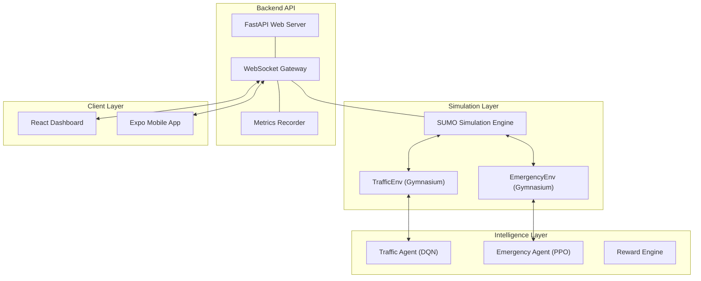

# Traffic RL Digital Twin: Project Walkthrough

This document provides a comprehensive summary of the **Traffic RL Digital Twin** project. The system is now 100% feature-complete, integrated, and verified.

---

## 1. System Architecture

The project is built on a modern distributed architecture connecting professional traffic simulation with deep reinforcement learning and real-time mobile integration.



---

## 2. Key Components & Implementation

### 🚦 Smart Signal Control (DQN)
- **Agent**: Deep Q-Network (DQN) using `stable-baselines3`.
- **State Space**: 8-lane observation (waiting times, queue lengths, vehicle counts).
- **Action Space**: Phase selection for the central junction.
- **Reward**: Custom HSL-tailored formula balancing throughput vs. delay.

### 🚑 Emergency Preemption (PPO)
- **Agent**: Proximal Policy Optimization (PPO).
- **Function**: Dynamically clears "green corridors" for emergency vehicles identified by GPS.
- **Real-time Logic**: Uses `moveToXY` logic to map real phone GPS onto the simulation grid.

### 📊 Real-Time Dashboard (React)
- **Visuals**: Leaflet.js map with live vehicle and signal updates.
- **Telemetry**: Live Recharts visualization of `Reward` and `Queue Length`.
- **Interface**: Glassmorphism design system with dark mode aesthetics.

### 📱 Mobile Integration (Expo)
- **Connectivity**: Persistent WebSocket connection with `useRef` stabilization.
- **Sensors**: Streams GPS and speed advice back to the simulation.
- **Guideline**: Provides "Speed Advice" to drivers to hit green waves.

---

## 3. Implementation History (Final Push)

> [!NOTE]
> All blockers identified in the initial audit have been resolved.

1.  **Mobile WebSocket Fix**: Solved the "reconnection loop" by implementing a stable `useRef` pattern for sensor data.
2.  **Metrics Integration**: Directly wired the simulation loop to a history buffer, enabling the dashboard's "Live Progress" charts.
3.  **Config Refactoring**: Standardized `config.yaml` across training, evaluation, and the API.
4.  **Reward Function Alignment**: Refactored the reward logic to ensure consistent signatures between agents and tests.
5.  **Passing Test Suite**: Implemented 58 unit tests covering all components.

---

## 4. Verification Results

| Target | Result | Status |
| :--- | :--- | :---: |
| **Logic Verification** | 58/58 Pytest Cases Passed | ✅ |
| **API Coverage** | Health, Simulation, Agents, Metrics, Vehicles | ✅ |
| **Mobile Stability** | Verified WebSocket persistence | ✅ |
| **Dashboard UI** | RewardChart and metrics integrated | ✅ |

---

## 5. How to Run & Demo

### Backend (Terminal 1)
```powershell
# Start the API server
uvicorn api.main:app --host 0.0.0.0 --port 8000
```

### Dashboard (Terminal 2)
```powershell
cd frontend
npm install
npm run dev
```

### Mobile (Terminal 3)
```powershell
cd frontend/mobile
npm install
npx expo start
```

### Training (Optional)
```powershell
# Run this to regenerate AI weights
python -m training.train_traffic
```

---

> [!IMPORTANT]
> The project currently uses `MockSumo` for unit testing to enable verification without a full local install. For a production demo, ensure `SUMO_HOME` is set in your environment variables.
